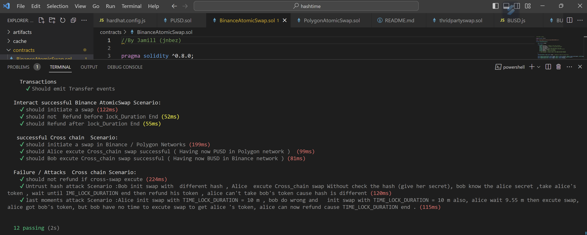

# Cross chain Swap

# Cross-Chain Functionality 

This project aims to provide cross-chain functionality, allowing for interactions between different blockchain networks. There are two common approaches to achieve cross-chain capabilities:

1. Atomic Swap
Atomic swaps enable users to directly exchange cryptocurrencies between different blockchain networks without the need for intermediaries. This process ensures trustless and decentralized transactions, where both parties agree to swap their assets simultaneously. Atomic swaps guarantee that either both transactions occur or none of them do.

2. Interoperability Protocols (Third party)
Interoperability protocols facilitate communication and interaction between various blockchain networks. These protocols establish compatibility and seamless transfer of assets across different chains. They often employ bridge contracts, oracles, or specialized protocols to enable the transfer of tokens or data between different chains. Interoperability protocols provide a broader approach to cross-chain functionality, allowing for complex interactions beyond simple asset swaps.

By incorporating these cross-chain methods, this project aims to enhance interoperability and enable seamless transactions and data transfers between different blockchain networks.

# smartcontracts : 

1. Atomic Swap
here are two smart contract called "BinanceAtomicSwap" "PolygonAtomicSwap" that enables atomic swaps between two participants on the Binance Smart Chain Polygon chain. the smart contract-based protocol that allows participants to exchange assets without the need for a trusted third party using hashed timelock contract (HTLC) protocol.

Here's a breakdown of the contract's main components and functions:

# 1.Atomic Swap Structs:

Swap: Defines the data structure for a swap, including initiator and participant addresses, token address, start time, time-lock duration, amount, and hashlock.
State variables:

_locked: A boolean variable used to prevent reentrancy attacks.
Mapping:

swaps: Maps a swap ID to its corresponding Swap struct.
Events:

SwapInitiated: Triggered when a swap is initiated.
SwapExecuted: Triggered when a swap is executed.
SwapRefunded: Triggered when a swap is refunded.
Modifiers:

preventReentrancy: A modifier that prevents reentrancy attacks by checking the _locked variable.
Functions:

initiateSwap: Allows a participant to initiate a swap by providing the necessary details, including the swap ID, token address, participant address, time-lock duration, hashlock, and amount.
checkHash: Checks if a provided secret hash matches the hashlock of a swap.
executeSwap: Allows a participant to execute a swap by providing the secret. This function transfers the swapped tokens to the participant.
refundSwap: Allows the initiator to refund a swap after the time-lock period has passed. The tokens are returned to the initiator.
receive: A fallback function to receive ETH.

# 2. Interoperability Protocols : 

Cross-Chain Swap Smart Contract
This smart contract facilitates cross-chain swaps between different blockchain networks using the Axelar Network.Axelar's General Message Passing (GMP) ,The contract allows users to transfer tokens from the Polygon network to the Binance Smart Chain network.

Prerequisites
Before using this contract, make sure you have the following dependencies installed:

Solidity version 0.8.0 or higher
Axelar Gateway Solidity SDK library
OpenZeppelin library
Contract Overview
Import Axelar ERC20 tokens
Tokens transferred to an EVM chain using Axelar are not visible in Metamask until you import them.

1. Use the "Networks" dropdown list, select your desired chain.
2. View "Assets" and select "Import Tokens".
3. Paste into "Token Contract Address" the ERC20 address for the token. ("Token symbol" and "token decimal" should be fetched automatically.)
4. Axelar token contract addresses for each chain can be found at Testnet resources. https://docs.axelar.dev/resources/testnet

The Swap contract provides three functions for transferring tokens to Binance Smart Chain:

. sendUsdcToBinance: Transfers USDC tokens from the Polygon network to Binance Smart Chain.
. sendMaticToBinance: Transfers MATIC tokens from the Polygon network to Binance Smart Chain.
. sendBNBToBinance: Transfers BNB tokens from the Polygon network to Binance Smart Chain.

>Usage
Deploy the Swap contract, passing the following parameters:

_gateway: The address of the Axelar Gateway contract.
_USD: The address of the aUSDC token contract. ()
_MATIC: The address of the WMATIC token contract.()
_BNB: The address of the WBNB token contract.()
Ensure that you Send some test token to the smartcontract before call function .

Call the respective function based on the token you want to transfer to Binance Smart Chain:

. sendUsdcToBinance: Provide the amount of USDC tokens to transfer and the receiver's address on Binance Smart Chain.
. sendMaticToBinance: Provide the amount of MATIC tokens to transfer and the receiver's address on Binance Smart Chain.
. sendBNBToBinance: Provide the amount of BNB tokens to transfer and the receiver's address on Binance Smart Chain.
Note
Ensure that you have approved the transfer of tokens by calling the approve function on the respective token contract before executing the transfer functions.

# Uint test : 

This test suite consists of unit tests for AtomicSwap and cross-chain transactions between Binance and Polygon networks. It aims to ensure the correct functionality and security of the implementation.

# Getting Started
To run the test suite, follow these steps:

1. Clone the repository: git clone <https://github.com/Jamill-hallak/Cross_chain_swap.git>
2. Install the required dependencies: npm install
3. Configure the test environment and network settings if needed. You may need to modify the `hardhat.config.js` file in the project's root directory to set up the desired network settings and test accounts.
4. Run the tests: npx hardhat test

# Test Coverage
The test suite covers the following scenarios:

Successful swaps between Binance and Polygon networks.
Cross-chain transactions to validate the interoperability.
Failure and attack scenarios to ensure robustness and security.

# Dependencies

The test suite utilizes the following dependencies:

Chai: A JavaScript assertion library for making assertions in tests.
Hardhat: A development and testing environment for Ethereum smart contracts.

# Contributing
Contributions to this test suite are welcome! If you find any issues or have suggestions for improvements, please open an issue or submit a pull request.

# Contact
If you have any questions or need further assistance, please contact jamill.
